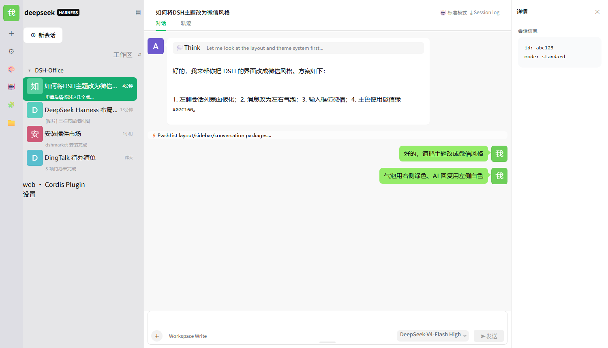

# dsh-wechat-skin 🟢

A skin for **DeepSeek Harness (DSH)** that gives the UI the look and feel of
**WeChat for Windows**.

> A native DSH dual-face plugin (same shape as
> [dsh-dream-skin](https://github.com/RevolutionLA/dsh-dream-skin)), built on the
> official `--dsw-*` design tokens, `ctx.theme.overrideTokens`, and `ctx.slots`
> extension points. **No injection, no patching of the install, survives DSH
> updates.**

[中文](./README.md)

## 📸 Preview



---

## ✨ Features

| Area | Result |
|---|---|
| 🟢 Far-left rail | 56px gray (`#DEDEE4`) icon bar: your avatar on top (click to upload), up to 6 configurable function icons (gray line SVGs) |
| 📋 Conversation list | `#E6E6E8` panel; **solid green `#15AC70` selected row with white text**; two lines (title + last-message subtitle); **40px rounded-square photo avatars** (stable per session) |
| 💬 Message bubbles | Your messages = right-aligned green `#95EC69`; AI replies = left-aligned white; 8px radius + WeChat-style tails; **bubble top edge flush with avatar top edge** |
| 👤 Message avatars | You (right) = uploaded/default avatar; AI (left) = **the active conversation's sidebar avatar** |
| 🔤 Typography | Microsoft YaHei; your text and AI replies same size, no bold; **5-level font size** (default = middle) |
| ⌨️ Composer | Full-width white, `#E0E0E0` border + rounded corners; **drag the top or bottom edge to resize** (persisted); rectangular 「发送」button (gray when empty / green with text) |
| 🖼️ Avatars | **Generated colored-initial avatars by default** (deterministic & stable); optionally run a script to download **100 real portraits** (80 female / 20 male); **upload your own avatar** |
| 🌓 Light/dark | Light only; dark mode automatically falls back to the official DSH look |

---

## 🚀 Quick install

```sh
# 1. install (local dir or npm package)
dsh plugin --profile desktop add -w /path/to/dsh-wechat-skin

# 2. restart DSH Desktop

# 3. auto-applies; toggle in Settings → General → WeChat Skin
```

---

## ⚙️ Settings (Settings → General → WeChat Skin)

| Setting | Description |
|---|---|
| Enable / disable | One-click toggle (disable restores the official look) |
| Font size (5 levels) | S / M / L tiers; default is the middle (current) size |
| Upload my avatar | Pick a local image (auto-downscaled to 128px), replaces your avatar everywhere |
| Left rail functions | Check up to 6 function icons (new session / settings / appearance / models / plugins / workspace / about) |

---

## 🛠️ Development

```sh
# regenerate the avatar pool (80 female + 20 male from randomuser.me)
node scripts/download-avatars.js

# rebuild lib/client.js (inject avatars.json + src/wechat-skin.css)
node scripts/build.js
```

Edit `src/wechat-skin.css`, run `node scripts/build.js`, then hard-refresh DSH (`Ctrl+F5`).

---

## 📌 Notes & limitations

- **Appearance only**: no feature/entry is removed or moved; code blocks, tool
  calls, attachments remain fully functional (restyled as subtle gray rows).
- **Subtitles**: progressively recorded for conversations you open (localStorage).
- **Settings section deep-links**: rail icons open Settings and best-effort jump
  to the section (DSH exposes no deep-link API; some sections may stop at Settings).
- **Sidebar auto-collapse** below 1024px is DSH's own responsive behavior.
- **Dark mode**: the skin only recolors light mode.

## 📄 License

[MIT](./LICENSE)
